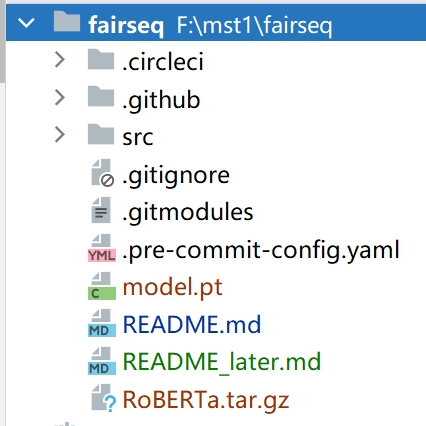

# RoBERTa

## 相关大文件下载
1. conda package下载：https://pan.seu.edu.cn:443/link/DD2C607645BDFE29F170E4A45CC0412A
有效期限：2028-10-19
访问密码：Q8rz
2. 已训练好的`model.pt`下载：https://pan.seu.edu.cn:443/link/A283F7808F10ECFA1F1752D4C22FDD66
有效期限：2028-10-20
访问密码：X2d8
3. HuggingFace相关（暂时不用）：https://pan.seu.edu.cn:443/link/3D80A0FFBB56DB0AC396666DC37112FD
有效期限：2028-10-20
访问密码：LngL

4. 下载完成后请**直接**放置在当前文件夹，使用`pwd`命令查看当前目录，应该为`../../../fairseq/`，`RoBERTa.tar.gz`和`model.pt`在当前目录下

## conda 环境解压

1. 创建目录 `RoBERTa`，并将环境解压至该目录：

    ```shell
    mkdir -p RoBERTa
    tar -xzf RoBERTa.tar.gz -C RoBERTa
    ```


2. 激活环境，同时这步操作会将路径 `RoBERTa/bin` 添加到环境变量 path：

    ```shell
    source RoBERTa/bin/activate
    ```

3. 在环境中运行 Python，确认版本无误后请进入预训练部分：

    ```shell
    (RoBERTa) $ python
   Python 3.9.18 (main, Sep 11 2023, 13:41:44)
    ```
   
4. **之后的全部代码运行完成后**，停用环境以将其从环境变量 path 中删除
   ```shell
   (RoBERTa) $ source RoBERTa/bin/deactivate
   ```
## 微调
### 1.  预处理数据

数据应该按照语言建模格式进行预处理，即每个文档之间应该用空行分隔（只在使用 --sample-break-mode complete_doc 时有用）。在训练期间，这些行将被连接成一个一维文本流。

#### 首先分割数据集
   ```bash
   cd src
  python split_data.py
   ```
请注意修改`split_data.py`文件中的`txt_files`参数为所有数据文件组成的列表
然后将所有数据移至当前目录的`mydata`文件夹中
   ```bash
  mv data.train.raw ./mydata/
  mv data.test.raw ./mydata/
  mv data.valid.raw ./mydata/
   ```
####  使用 GPT-2 BPE 进行编码
```bash
for SPLIT in train valid test; do \
    python -m examples.roberta.multiprocessing_bpe_encoder \
        --encoder-json gpt2_bpe/encoder.json \
        --vocab-bpe gpt2_bpe/vocab.bpe \
        --inputs mydata/data.${SPLIT}.raw \
        --outputs mydata/data.${SPLIT}.bpe \
        --keep-empty \
        --workers 60; \
done
```
更换数据时，请将数据放入一个文件夹内，如创建`mydata`文件夹，将`data.train.raw` `data.test.raw`和`data.valid.raw`放入该文件夹，并将`inputs`参数行改为`--inputs mydata/data.${SPLIT}.raw \`，对应`outputs`参数行改为`--outputs mydata/data.${SPLIT}.bpe \`

#### 使用 GPT-2 fairseq 字典进行预处理/二进制化数据
```bash
fairseq-preprocess \
    --only-source \
    --srcdict gpt2_bpe/dict.txt \
    --trainpref mydata/data.train.bpe \
    --validpref mydata/data.valid.bpe \
    --testpref mydata/data.test.bpe \
    --destdir data-bin/mydata \
    --workers 60
```
此处`trainpref` `validpref` `testpref`和`destdir`参数注意更改，与上一步同理
### 2.  在特定数据集上微调
这里指定`DATA_DIR`相对路径可能会出问题，建议使用绝对路径，注意更改`DATA_DIR`
```bash
DATA_DIR=data-bin/mydata
```
`finetune`的`config`放在了`src/examples/roberta/config/finetuning/finetune.yaml`,请根据实际情况调整参数，需要注意的是`src/examples/roberta/config/finetuning/finetune.yaml`的`max_update`参数必须大于`src/examples/roberta/config/pretraining/base.yaml`中的该参数
```bash
mv ../model.pt ./
fairseq-hydra-train -m --config-dir examples/roberta/config/finetuning --config-name finetune task.data=$DATA_DIR  checkpoint.restore_file=./model.pt
```

## PT文件转为标准HuggingFace
首先通过以下命令找到`checkpoint_best.pt`文件
```bash
find . -type f -name "*.pt"
```
移动到一个文件夹pt里
```bash
mkdir pt
cp checkpoint_best.pt文件的路径 ./pt/model.pt
cp ./gpt2_bpe/dict.txt ./pt/
```

```bash
python convert_roberta_original_pytorch_checkpoint_to_pytorch.py --roberta_checkpoint_path ./pt/  --pytorch_dump_folder_path ./
```
当前目录新生成的`pytorch_model.bin`和`config.json`即为目标文件
## REF
>Ott, M., Edunov, S., Baevski, A., Fan, A., Gross, S., Ng, N., Grangier, D., & Auli, M. (2019). fairseq: A Fast, Extensible Toolkit for Sequence Modeling. Proceedings of NAACL-HLT 2019: Demonstrations.
